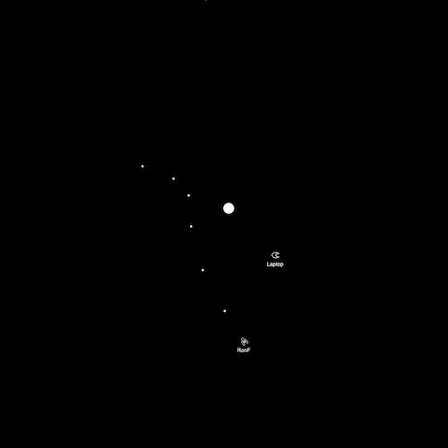

WebRTC Spacewar
===============

WebRTC Spacewar is a browser-based recreation of the PDP-1 `Spacewar!`__
game, based on an X11 version I wrote in C back in 1992.

__ https://en.wikipedia.org/wiki/Spacewar!

Motivation
----------

I created the original version of Spacewar to show how to build a
network-based multi-player game without a server. Clients communicated
directly with one another to share game state. For a two player game,
players specified each other's IP address when starting the game. More
than two players was also supported, by having all the players specify
a common IP multicast group address. Game updates would be sent to that
address and delivered to all other clients which joined that multicast
group. Each client would then independently render a view of all the
ships without the need for a central server. With synchronized clocks,
the clients came very close to all showing the same result within the
limits of the network latency, and any errors due to latency would
automatically be corrected by later game updates.

With this new version of Spacewar, my initial goals were:

  * Learn something about what Javascript is capable of in modern
    web browsers
  * Learn how WebSockets work and what they're capable of

Due to web browser security restrictions, a true peer-to-peer version
of the game in a browser with no server at all wasn't possible, but I
wanted to keep all the actual game logic completely within the browser,
implementing only a very basic WebSocket "relay" that replaced the
IP multicast communication in my original version. More details on
this WebSocket relay can be found `here`__.

__ ws-relay.rst

Once I had the WebSocket version of the game running, I decided it
would also be interesting to use this project as an opportunity to
learn more about what WebRTC was capable of, getting closer to the
true peer-to-peer nature of my original implementation by using
WebRTC data channels to send game state directly between clients.
Unfortunately, WebRTC doesn't support IP multicast, so that had to
be simulated by building a mesh of unicast connections between the
clients. Also, to set up WebRTC, a signaling channel had to be
provided, but the WebSocket relay I had already written turned out
to be perfect for that.

Game Basics
-----------

The basic game controls let you turn your ship, thrust in whatever
direction you are facing, and fire missiles in that direction. You can
fire two missiles per second, and they'll deactivate after five seconds,
or sooner if they hit something.

Be sure to take into account the sun's gravity when maneuvering and
aiming your missiles. If you like, you can slingshot your ship or your
missiles around the sun, but don't get too close or you'll be sucked
in, and be careful not to shoot yourself!

If a ship collides with the sun, another ship, or a missile, it will be
destroyed, causing debris to spread out in the direction the ship was
moving. Beware! A ship can also be destroyed by colliding with debris!
After a few seconds, a destroyed ship will be returned back to a
circular orbit around the sun.

If you fly off the edge of the screen, you can use the zoom keys to zoom
out, and if you really get lost you can hit `Enter` to go into hyperspace,
returning back to a circular orbit around the sun a few seconds later.
This can also be used to avoid collisions, though there's no guarantee
you won't collide with something when you come out of hyperspace.

In addition to zooming the view in and out, you can click the mouse to
re-center your game view on the position you click on, and if you click
on a ship it will lock the view onto that ship, keeping it in the center
of the screen for a "first person" view of the action. This is also a
good way to see the details of the ship designs by clicking on them and
then zooming all the way in.

Observer mode lets you watch a game without having your own ship. You
can use `O` to toggle between observing and actively playing.

You can use `P` to stop and start the game without leaving the web page.

Primary controls:
^^^^^^^^^^^^^^^^^

================== ================
Key                Control          
================== ================
A, H, Left Arrow   Rotate left
S, J, Right Arrow  Rotate right
D, K, Up Arrow     Thrust
F, L, Spacebar     Launch missile
Enter, Return      Enter hyperspace
================== ================

Additional controls:
^^^^^^^^^^^^^^^^^^^^

=========== ====================
Key         Control
=========== ====================
Z           Zoom view in
X           Zoom view out
R           Reset view
Left click  Re-center view
C           Configure game
N           Toggle names
O           Toggle observer mode
P           Play/pause game
=========== ====================

Game Configuration
------------------

The configuration panel for the game will be brought up the first time
you play, and can also be brought back by hitting `C`. You can configure
a name to show under your ship and also choose whether to use WebRTC
or WebSockets for sending game updates. If you enable WebRTC, you can
also configure a STUN or TURN server. I provide a default TURN server
for the version of this game that I host myself.

Any configuration you enter is stored locally using browser local storage,
so it should be remembered across game sessions.

Acknowledgments
----------------

I want to thank some of my former coworkers at Xerox PARC for
contributing ship designs used in my original implementation of
Spacewar, which I have carried forward here!

Next Steps
----------

Find out how to install your own instance of Spacewar `here`__, or
click on the following to play my existing instance of the game:

__ INSTALL.rst

.. raw:: html

    

      
    

